# pocketbeam

Wireless ebook sync for PocketBook e-readers. pocketbeam runs on the reader itself: it pulls new and updated books over Wi-Fi from any OPDS server ([Calibre-Web Automated](https://github.com/crocodilestick/Calibre-Web-Automated), Calibre-Web, COPS, Calibre's content server) or any WebDAV share (Nextcloud, ownCloud, Synology) and drops them straight into the device's library. No PC in the loop after the one-time install, and every sync is an incremental diff against local state, so only what changed is downloaded.

## Install on your PocketBook

Written for someone who has never sideloaded an app. Building pocketbeam yourself is in [Development](#development).

### What you need

- A PocketBook e-reader on firmware 6.x. Development and testing happen on an Era Color; other recent PocketBook models run the same InkView firmware and are expected to work, but they are untested.
- Wi-Fi on the reader.
- A book server: Calibre-Web, Calibre-Web Automated or any other OPDS catalog, or a WebDAV share (Nextcloud, ownCloud, Synology).
- The USB cable that came with your reader (USB-C on the Era Color, micro-USB on older models), for the first install only.

### 1. Download pocketbeam

Go to the [latest release](https://github.com/haraldpdl/pocketbeam/releases/latest) and download `pocketbeam-app.zip`. Unpack it and you have one file, `pocketbeam.app`:

- **Windows**: right-click the zip, "Extract All...". Explorer puts the file in a new folder called `pocketbeam-app`; the file inside it is the one you need.
- **macOS**: double-click the zip in Finder.
- **Linux**: `unzip pocketbeam-app.zip`.

Releases up to and including `v0.5.0` predate the zip and carry only `pocketbeam.app.gz`. Unpack that one with `gunzip pocketbeam.app.gz` on Linux and macOS, or with [7-Zip](https://www.7-zip.org/) on Windows; it yields the same single `pocketbeam.app` file.

The release also carries `pocketbeam.app.gz` (the copy the app's own updater downloads) and `SHA256SUMS`, which covers both downloads, if you want to verify them (on Linux, in the download folder: `sha256sum -c SHA256SUMS`). The digest of the unpacked `pocketbeam.app` itself is in the release notes, since GitHub will not host that file under its own name.

### 2. Copy it to the device

Connect the reader to the computer with the USB cable and confirm the USB connection on the reader; it appears as a normal removable drive. Copy `pocketbeam.app` into the folder named `applications` at the top level of that drive. If there is no such folder, create one named exactly `applications`. Eject the drive properly, then unplug the cable.

### 3. Start it for the first time

On the reader, open Applications and tap `@pocketbeam`. Sideloaded apps are listed with a leading `@` and a generic icon; that is how the PocketBook firmware presents them (KOReader shows up as `@koreader` the same way).

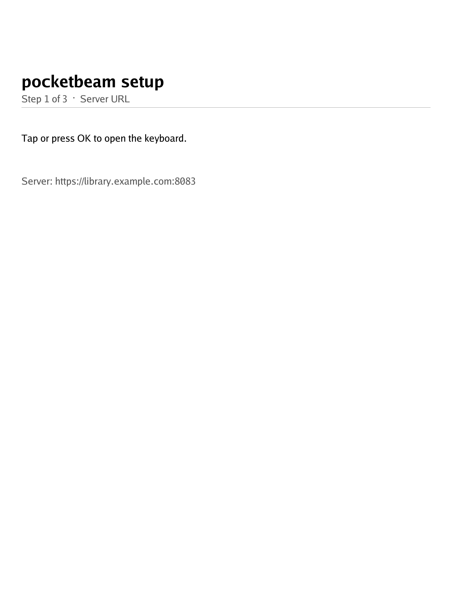

The setup wizard asks, in order:

1. **Server type**: Calibre-Web / OPDS, or WebDAV / Nextcloud.
2. **Server URL**: e.g. `http://library.lan:8083` for OPDS (a path prefix such as `https://example.com/calibre` is fine), or `https://nc.example.com/remote.php/dav/files/alice` for WebDAV.
3. **Username**.
4. **Password**.

It then tests the connection and, on success, lands on the sync screen; tap **Sync Now**. On failure it names the problem (bad URL, wrong credentials, server unreachable, ...) and offers a retry.

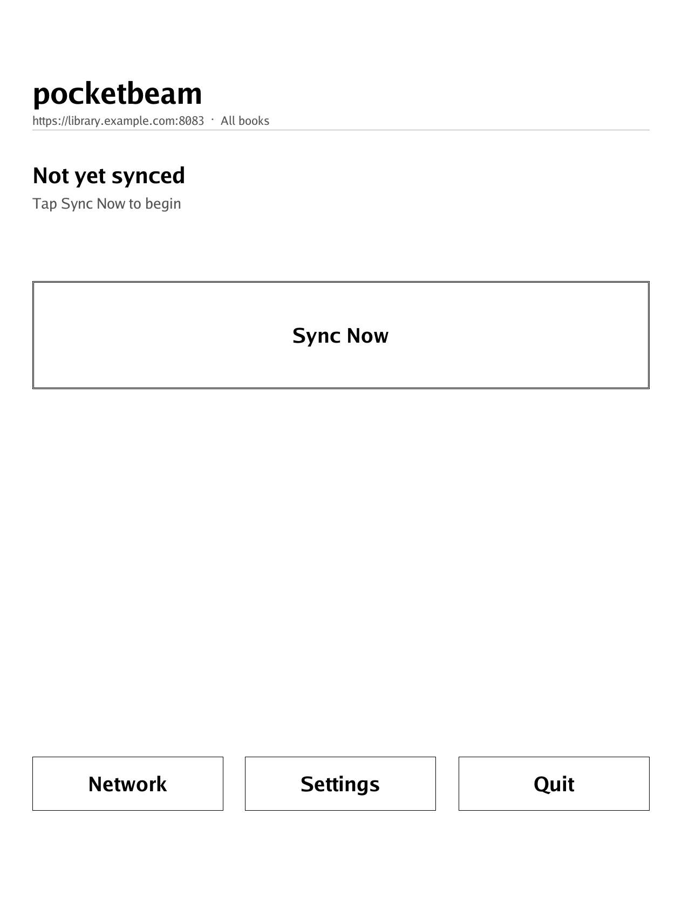 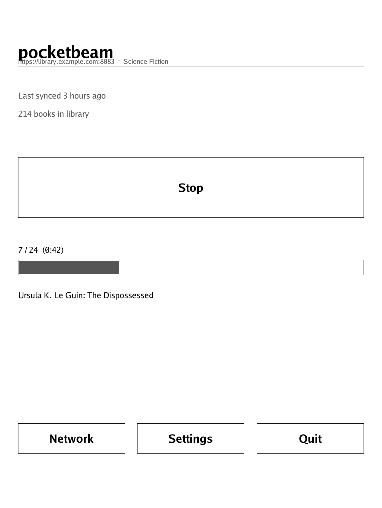

The sync screen as it looks straight after the wizard, and while a sync runs. During a sync the button reads **Stop**, and the strip below it counts the books and names the one being downloaded. The first run fetches everything that matches your selection, so it is the long one; later runs download only what changed.

Books are stored in `Books/default` on the reader's internal storage. Each extra server profile you add later gets a folder named after the profile (see [Usage](#usage)). After the download finishes, pocketbeam runs the stock library scanner so the new books appear in Library.

### 4. Updates

pocketbeam checks for new releases on its own: once at first start, weekly after that, and on demand via **Check for updates** in Settings. When a newer release exists, that row reads **Install update vX.Y.Z** and installs it in place, so there is no second USB trip. See [Updates and privacy](#updates-and-privacy) for what the check does and how to switch it off.

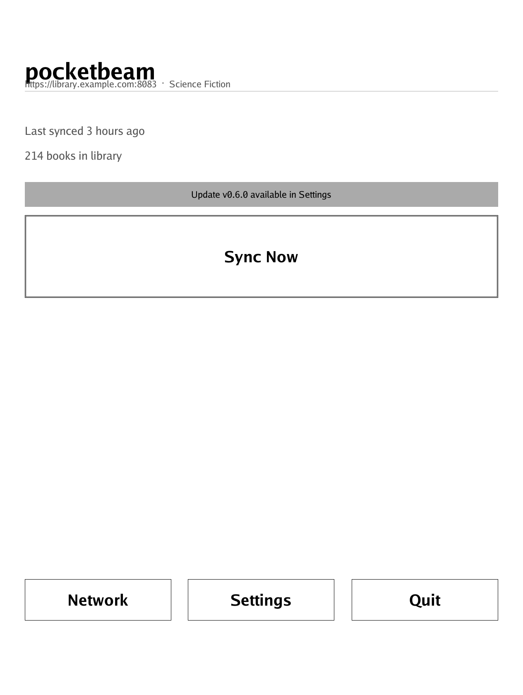 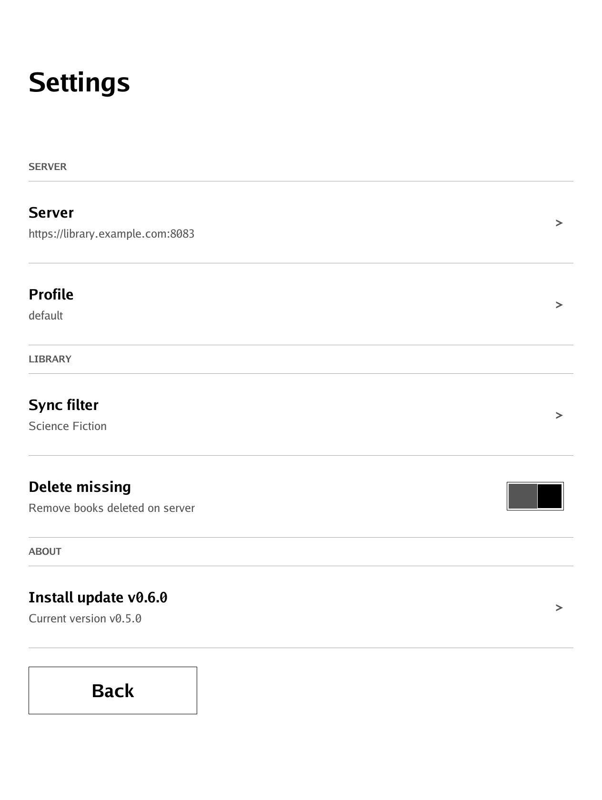

The sync screen after a few syncs with an update waiting, and the Settings list it points at: the badge above the Sync Now button announces it, and the **Install update** row that performs it sits in Settings under ABOUT. Settings is also where the server, the profile and what gets synced live; [Usage](#usage) goes through every row.

**Going back to an older version:** delete `system/config/pocketbeam.db` over USB before you start it. The sync state file is upgraded in place on first launch, and an older release cannot read the upgraded format: left in place, it makes every book fail and download again on every sync. Deleting it costs nothing but one re-scan — your settings live in `pocketbeam.cfg`, the books stay under `Books/`, and the next sync tracks them again.

### Troubleshooting

- **`@pocketbeam` is not in the Applications menu.** The file has to sit directly in `applications` at the root of the internal drive, not in a subfolder, and its name has to end in `.app`. A common miss on Windows: "Extract All..." leaves a folder named `pocketbeam-app` and the file is inside it, so copying the folder puts `pocketbeam.app` one level too deep. If the folder looks right, reboot the reader so the launcher re-reads it.
- **The connection test fails.** The URL needs the scheme (`http://` or `https://`) and, unless the server answers on port 80 / 443, the port: `http://library.lan:8083`. For OPDS give only the server's base URL, pocketbeam appends `/opds` itself. Opening the same URL in the reader's web browser tells a wrong address apart from a Wi-Fi problem.
- **The sync ran but no books arrived.** Open Settings and check **Sync filter** (OPDS) or **Sync folder** (WebDAV): only what is selected there is synced. Books that are already on the device are skipped, so a second run downloading nothing is normal.

### Uninstall

Connect over USB and delete `applications/pocketbeam.app`. To remove its settings and sync state as well, delete `system/config/pocketbeam.cfg` and `system/config/pocketbeam.db`. Downloaded books are ordinary files under `Books/` and stay until you delete them yourself.

## Usage

The screens are pictured in the install guide above: the wizard and the sync screen, before and during a sync, in [Start it for the first time](#3-start-it-for-the-first-time); the sync screen with an update waiting and Settings in [Updates](#4-updates). The two pickers, the screens a sync raises on its own, and the profile screens are below; the update screen is in [Updates and privacy](#updates-and-privacy). Every image in this README is rendered from the app's own drawing code (`make screenshots`), so they stay in step with it.

The main screen has four actions:

- **Sync Now**: connects the Wi-Fi (wakes the radio if asleep), probes the server, then pulls the configured catalog (all books by default, or one or more filters / folders that you picked) and downloads everything that is new or updated since the last sync. Before downloads start, pocketbeam tallies what the run will transfer against the free space on the device; if the new books wouldn't fit, it shows a prompt with the shortfall and lets you cancel or proceed anyway. (Partial syncs are safe: the device just stops writing when the disk fills up.) Progress shows the current book counter, a live elapsed-time indicator, and the book title being downloaded. Already-synced books skip instantly. While a sync is in flight the same button reads **Stop**; tapping it halts the run cleanly at any stage, including the server probe and catalog listing (books already downloaded stay, the in-flight `.part` file is left for the next sync's stale-sweep to remove).
- **Network**: opens the PocketBook system network dialog so you can switch Wi-Fi networks or re-enable Wi-Fi if you had it off.
- **Settings**: five rows.
    - **Server**: shows the active server URL; tap it to re-run the wizard for the active profile.
    - **Profile**: shows the active profile's name; tap it for the profile list, paginated with Prev / Next like the pickers. Tap a profile to open its panel, where "Make active" switches to it and "Delete this profile" (tap twice) removes it; "Add new server" creates another (one device can sync from a home CWA, a friend's Nextcloud, and a public OPDS server, each as its own profile).
    - **Sync filter** (OPDS) / **Sync folder** (WebDAV): opens the picker. For OPDS, drills through the catalog's subsections; tapping a row descends, "Add this level" accumulates a selection, and "Done" saves the set. Empty subsections (opds:count = 0) are hidden, long lists paginate with Prev / Next. Each level fetch is capped at two minutes; a server that stops answering shows "Server did not respond in time." instead of loading forever. For WebDAV it drills through server directories the same way, under the same cap. The "< Back to ..." row at the top stays tappable while a level is loading and after a failed fetch, so a slow or flaky connection costs one level instead of the whole drill-down.
    - **Delete missing**: opt-in toggle. When on, every sync ends with a confirmation prompt listing books no longer on the server; tap Delete or Keep. Changing what a profile syncs (server, filters, folder) skips the prompt for one run, so widening or narrowing a selection never proposes the books you just excluded; each profile remembers what it last synced on its own, so switching between profiles does not skip it.
    - **Check for updates**: shows the running version and checks the release endpoint on demand; see [Updates and privacy](#updates-and-privacy).
- **Quit**: back to the Applications menu.

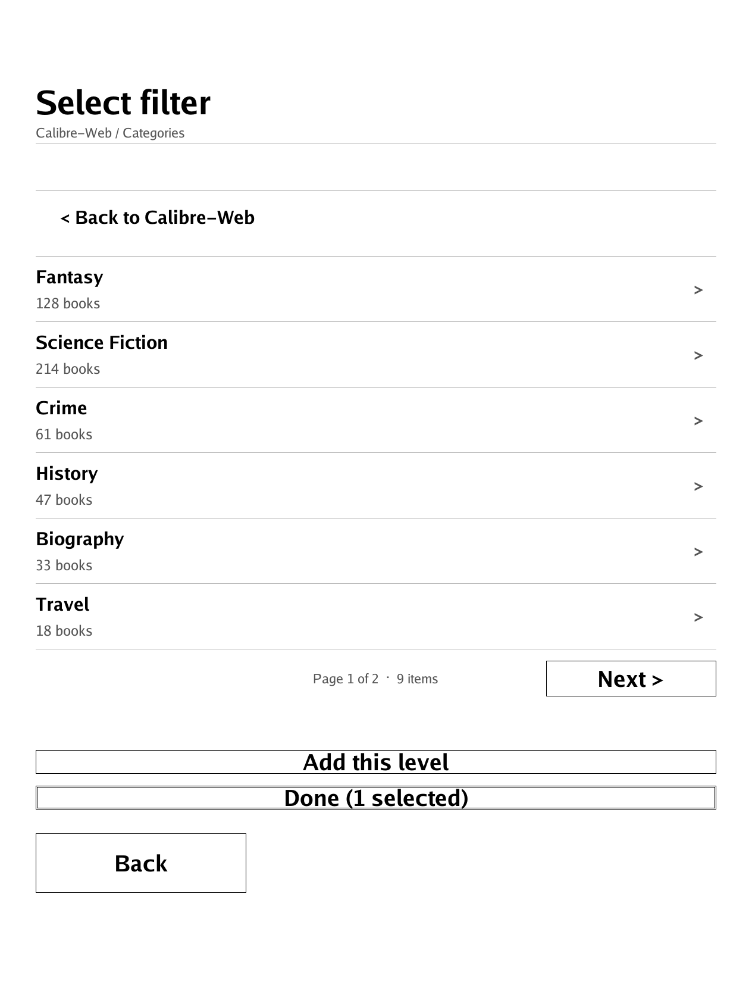 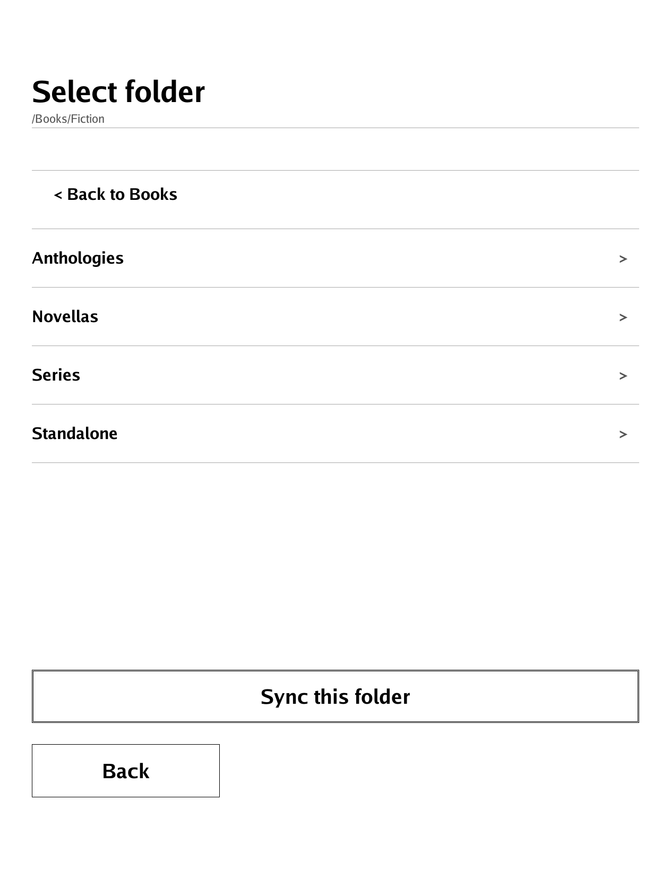

The two pickers, each part-way down a tree: the OPDS feed picker with one level already added to the selection, and the WebDAV directory picker listing the folders in a share. Tapping a row descends, the row at the top goes back up one level, and the button at the bottom saves what is on screen.

A sync raises three screens of its own, in the order they can appear:

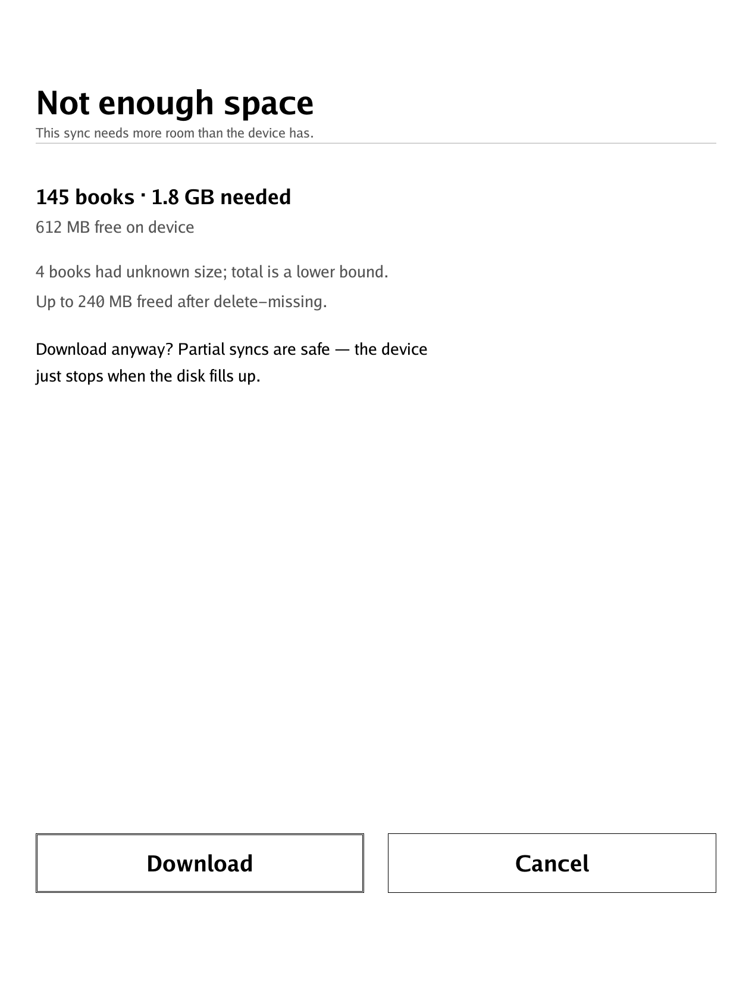 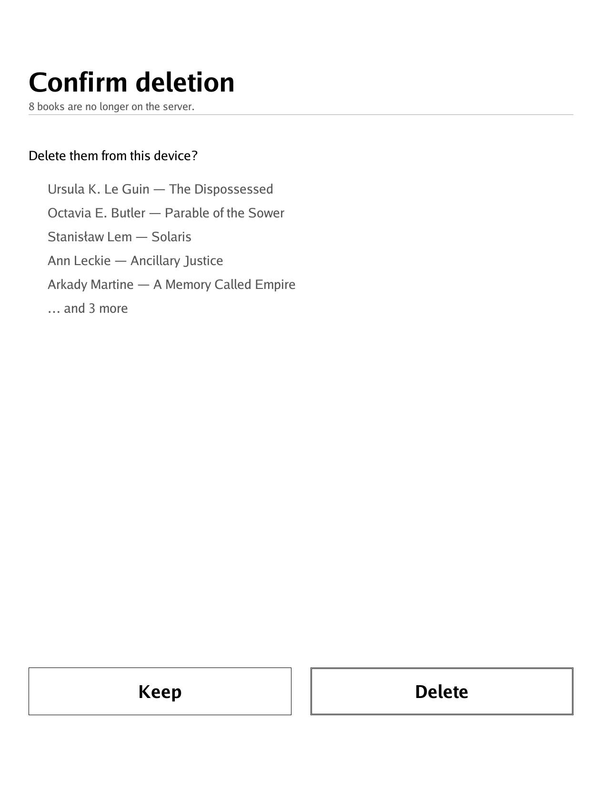 

The space warning comes before any download and only when the run would not fit; the delete-missing prompt comes after the downloads and only with the toggle on; the refresh dialog appears whenever the sync changed the library, and closes itself when the PocketBook scanner is done.

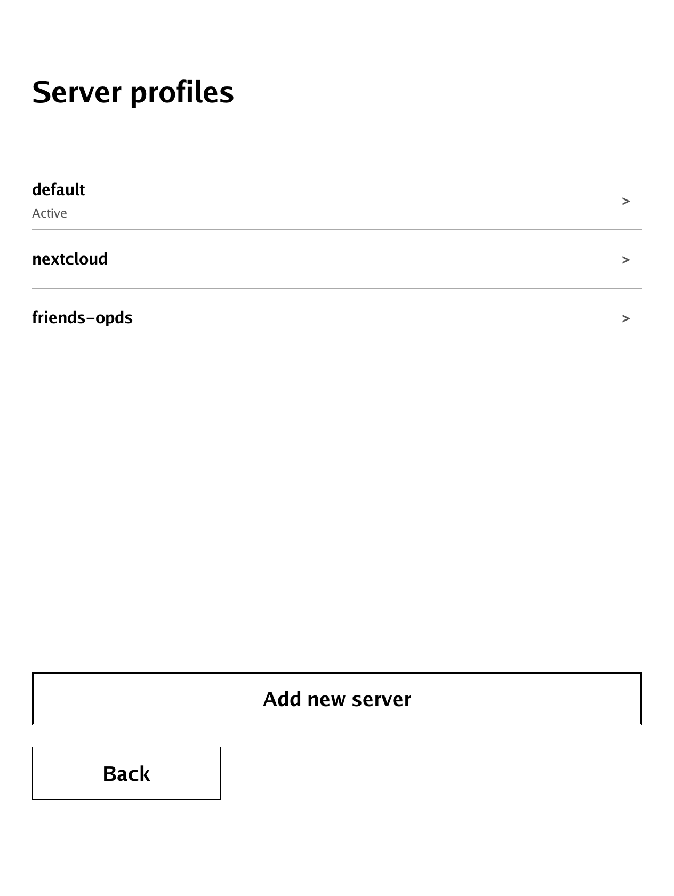 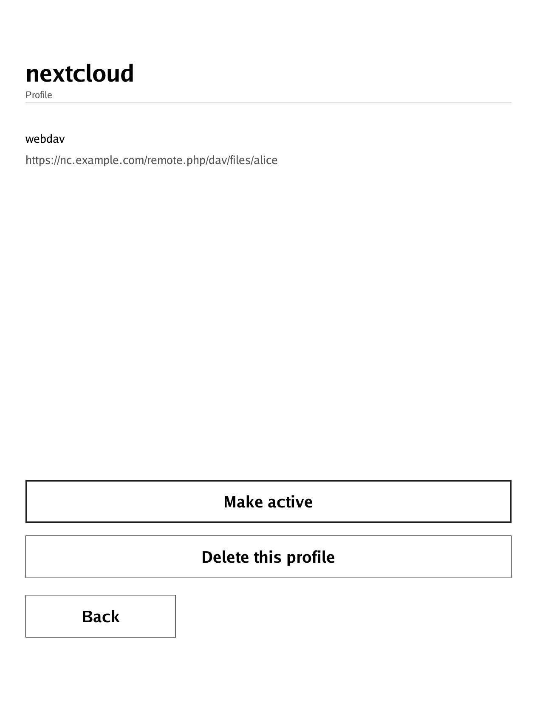

The profile list and the panel one profile opens into. The active profile is the one marked **Active**; every row opens a panel, and a profile that is not the active one offers **Make active** above the delete.

Books land under `/mnt/ext1/Books/<profile name>/<Author>/<Title>.<ext>` (`Books/default` on a fresh install, since the first profile is not named on screen) and show up in the device's library after the next library refresh. If a second, different book resolves to the same author and title (another edition, or a same-named file in another WebDAV folder), its filename gets a short `[xxxxxxxx]` tag so the two never share one file.

## Status

Early but working. The first-run wizard, main sync screen, settings, OPDS feed picker (nested + multi-select), WebDAV directory picker, and multi-server profile switcher all run under InkView on device. Primary development happens on a PocketBook Era Color (1264x1680); the layout scales for smaller panels (Touch HD, Touch Lux 5, InkPad X) via a three-tier width heuristic.

For OPDS servers, pocketbeam auto-detects whether the endpoint is Calibre-Web / Calibre-Web Automated and enables a fast path (shelf filters and a single-request "all books" listing) when it is. Against other OPDS servers (Calibre's built-in content server, COPS, Audiobookshelf's OPDS feed, etc.) it falls back to a generic recursive walker that navigates the catalog's subsections; all books still sync, just via more HTTP requests. If any subsection fails to load, the listing is aborted and the sync reports the error instead of working from a partial catalog (which would otherwise make delete-missing propose the unreachable books for deletion).

## Why

The stock OPDS catalog browser is regionally gated; on the German-market firmware of the Era Color it is not even in the Applications menu. The regional lock disables only the stock UI, not the network stack, so a custom app can talk to OPDS endpoints directly. Even where stock OPDS is available it is manual pull-on-demand; pocketbeam is built around one-tap sync of the entire library.

## Configuration file

For power users only. The wizard writes the config to `/mnt/ext1/system/config/pocketbeam.cfg`. The file uses `[section]` headers so multiple server profiles live side-by-side:

```ini
active   = home
state_db = /mnt/ext1/system/config/pocketbeam.db

[home]
backend     = opds
host        = http://cwa.lan:8083
user        = your-cwa-username
password    = your-cwa-password
library     = /mnt/ext1/Books/home
filter_href = /opds/shelf/3
filter_name = to-pocketbook
filter_href = /opds/category/tag/12
filter_name = Fantasy
delete_missing = on

[nas]
backend  = webdav
host     = https://nc.example.com/remote.php/dav/files/alice
user     = alice
password = hunter2
library  = /mnt/ext1/Books/nas
path     = /Books/Fiction
```

The wizard derives `library` from the profile name, filtered for characters the device's storage cannot take and suffixed with `-2`, `-3`, ... if the folder already belongs to another profile (compared the way the device's storage compares them, so `Books/CWA`, `Books/cwa` and `Books/cwa/` all count as one folder), so two profiles never share a folder. "Add new server" also refuses a name another profile already uses, which would otherwise repoint that profile at a new folder and leave its books behind. The first run does not ask for a name: a fresh install becomes `[default]` with `Books/default`, and only profiles added later with "Add new server" carry a name you chose (hence `home` and `nas` above). The derivation happens only when a profile is created: profiles set up by an earlier version keep their existing `Books/CWA` or `Books/WebDAV` folder, and re-entering the server details from Settings leaves that path (and the profile's filters, sub-directory and delete-missing setting) alone. Edit this key by hand to move a library and move the files with it; a book whose file is not in the configured folder is downloaded again on the next sync.

`filter_href` / `filter_name` can repeat to sync more than one feed per profile; books are deduped by UUID across the union. `state_db` is global and shared by every profile, but what it tracks is one entry per library and book, not one per book: a profile only ever sees, skips and re-downloads the books in its own library, and the book count on the main screen is that library's. Two profiles whose servers hand out the same identity (WebDAV identities are derived from the file path, and two servers can host the same path) therefore each download their own copy, each skip their own copy from then on, and each can drop their own copy when it disappears from their server, leaving the other profile's untouched.

Each entry also records the profile that downloaded it, and delete-missing only ever proposes that profile's own books. This matters where two profiles do share a folder: profiles set up before per-profile folders existed all point at `Books/CWA` or `Books/WebDAV`, and the folder is editable by hand besides. An existing state DB is upgraded in place on first launch (which can take a moment on a large library); each book already tracked joins the library its file is in, but nothing recorded which profile fetched it, so a profile claims a book the first time its server lists it. Until then, a book in a shared folder is never proposed for deletion by anyone. Once a book in a shared folder belongs to a profile it stays with it, even if the other profile re-downloads it after an edit on the server: there is only one file, and the profile that owns it is the only one that may delete it.

Two more optional top-level keys sit next to `active` and `state_db`: `check_updates = off` disables the weekly update check, and `update_url = https://...` points the checker at another release endpoint (a GitHub or Gitea releases API URL works, as does anything that serves the same JSON shape). `check_updates` is what the Settings toggle writes; `update_url` is file-only and is preserved when the app rewrites the config.

You can edit this file by hand over USB if you prefer not to go through the on-device wizard.

## Known limitations

- **App name shows as `@pocketbeam`** in the PocketBook launcher with a generic icon. This is the PocketBook firmware's default presentation for any sideloaded app and matches KOReader's `@koreader` presentation. Customising it requires editing `/mnt/ext1/system/config/desktop/view.json` and placing BMP icons under `/mnt/ext1/applications/icons/`; that is a per-user polish step, not part of the default install.
- **Password entry is visible** on the on-screen keyboard. The PocketBook InkView keyboard has no masked-input mode exposed through the SDK. Use a stance that blocks onlookers or set a throwaway password for device use.
- **Interrupting a sync leaves a partial download** as a `.part` file. The next sync's stale-sweep removes anything older than one hour, so no manual cleanup is needed.
- **Library refresh briefly takes over the screen.** After a sync that downloaded or deleted books, pocketbeam runs the stock PocketBook `scanner.app` so new covers and titles show up without you having to navigate into Library. Scanner steals foreground focus while it indexes; pocketbeam shows a "Refreshing library" dialog that closes itself when scanner exits.
- **Only tested on firmware 6.x.** Older firmware may lack the `NetMgrPing` keepalive API; sync will still work but the radio may drop during long runs.

## Updates and privacy

pocketbeam checks for new releases so you don't have to re-sideload manually. The check runs:

- **Once at first launch** after sideloading (there's no prior check timestamp, so the app hits the release endpoint within a few seconds of startup).
- **Once a week thereafter**, gated by the `last_update_check` timestamp stored in the local state DB.
- **On demand** via **Check for updates** in Settings.

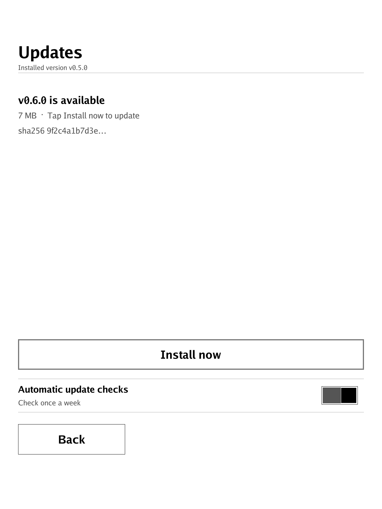 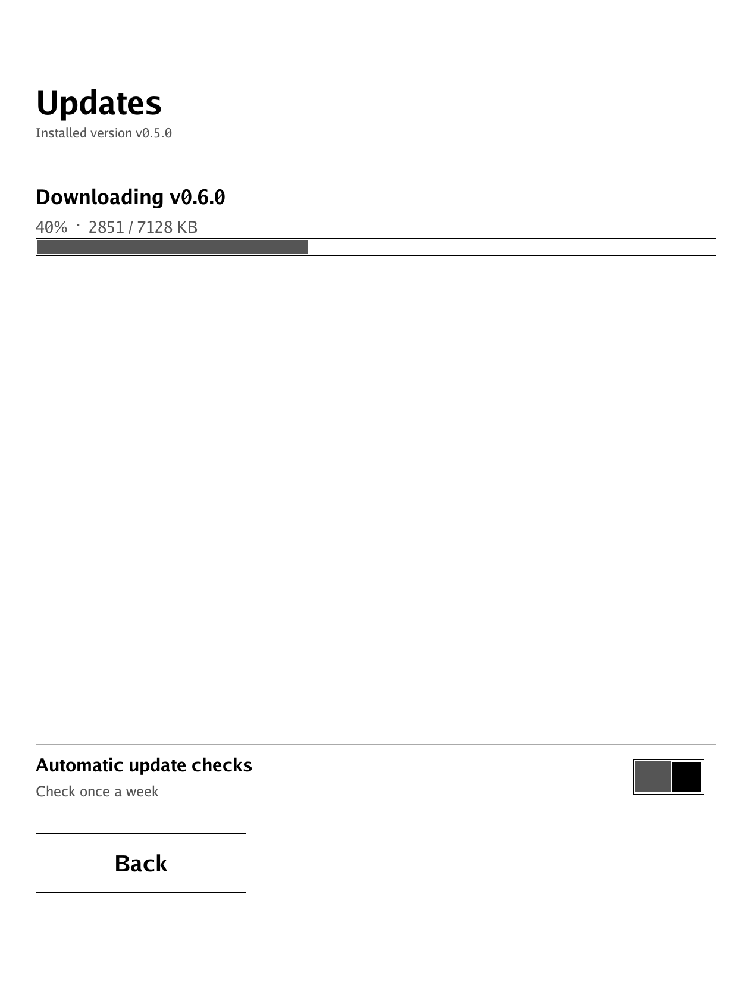

The Updates screen, reached from **Check for updates** in Settings: what a waiting release offers, and the download it starts. Leaving the screen mid-download does not stop it, and the install is only performed once the whole file has been verified against the digest in the release notes.

The update check is a single HTTPS GET to `https://pocketbeam.shinyredapples.com/releases/latest`, the endpoint compiled into the released binaries, or to whatever `update_url` you set in the config.

To disable all automatic update checks, open **Check for updates** in Settings, then tap the **Automatic update checks** row (it reads "Check once a week" when on) to flip it off. Manual "Check for updates" remains available on that screen even when automatic checks are disabled. Power users can also set `check_updates = off` at the top of `pocketbeam.cfg`.

The only outbound HTTP traffic pocketbeam ever initiates is (a) OPDS / WebDAV requests to your configured server, (b) the update check described above, (c) the release binary download when you tap Install.

Installs are verified: the downloaded binary must match the `sha256:` digest published in the release notes, and a release that publishes no digest is refused rather than installed unverified. Redirects from `https://` to `http://` are refused for the update check and the download, as they are for OPDS and WebDAV requests.

## Development

### Build the device binary yourself

The project expects to be built inside the [`sunsung/pocketbook-go-sdk`](https://hub.docker.com/r/sunsung/pocketbook-go-sdk) Docker image, which ships the PocketBook ARMv7 cross-compile toolchain. Inside the container `make arm` builds `dist/pocketbeam.app` with the version baked in and verifies the result is an ARM binary; the plain `go build` below is the same thing spelled out:

```sh
docker run --rm -v "$PWD":/app -w /app sunsung/pocketbook-go-sdk:latest \
    go build -ldflags="-s -w -X main.version=$(git describe --tags --always --dirty)" \
    -o pocketbeam.app .
```

The stripped binary is about 8 MB. The `-X main.version=...` flag bakes the current git tag into the binary; the on-device updater compares that against the latest published release to decide whether to offer an upgrade. A bare `go build` without the flag leaves the version as `dev`, which the updater treats as older than any tagged release (so the updater is always willing to replace a dev build with a real release). Copy the result onto the device the same way as a downloaded release, see [Install on your PocketBook](#install-on-your-pocketbook).

### Quality gates

Quality gates live in the `Makefile`. `make ci` is exactly what GitHub Actions runs: gofmt, `go vet`, staticcheck, `go mod tidy` drift, tests, an amd64 build, govulncheck, and the ARM build whenever the SDK toolchain is present. `make hooks` wires the same gates into your clone as pre-commit (`make quick`) and pre-push (`make ci`) hooks. Every change goes through a pull request; `main` requires the `quality` check.

The local state DB uses `mattn/go-sqlite3`, so the amd64 build and the tests need cgo and a C compiler; the ARM build needs the SDK's `arm-obreey-linux-gnueabi-clang`. The SDK container also exports `GOARCH=arm` and an ARM `CC` globally, which is why every host-side target pins its own environment instead of inheriting it.

### Iterating without a device

A second entry point compiles on every architecture except ARM (the device build) and runs the sync as a plain CLI without InkView, so you can iterate on the core logic without sideloading:

```sh
# dev build for fast iteration on a workstation or in the SDK container
GOOS=linux GOARCH=amd64 GOARM= CC=gcc CGO_ENABLED=1 go build -o pocketbeam-amd64 .

# run against a server
./pocketbeam-amd64 -config ./pocketbeam.cfg -v
```

Unit tests (`make test` sets the same environment):

```sh
GOOS=linux GOARCH=amd64 GOARM= CC=gcc CGO_ENABLED=1 go test ./...
```

Live tests against a real CWA (gated behind the `live` build tag; host and credentials come from `POCKETBEAM_TEST_HOST`, `POCKETBEAM_TEST_USER`, `POCKETBEAM_TEST_PASS`):

```sh
POCKETBEAM_TEST_HOST=http://cwa.lan:8083 go test -tags=live -run TestLive
```

### Screens without a device

Every screen draws through a small `Canvas` interface with two backends: InkView on the device, and an image renderer (the Go fonts, `golang.org/x/image/font`) everywhere else. Screens that draw through it can therefore be rendered, asserted on in tests, and turned into the images in this README without a PocketBook.

```sh
make screenshots   # regenerates docs/screenshots/*.png
```

`make test` re-renders the same screens and fails when a committed image no longer matches what the code draws, so a UI change either updates the images or is caught; it also fails on a PNG in `docs/screenshots/` that no screen renders any more, on a screen in `screenshots()` that the README never shows, and on a README image reference that no screen renders. The comparison is on decoded pixels, so a different PNG encoder is not a failure. When the `quality` job goes red it attaches a `screenshots` artifact holding the screens as that commit draws them, so a drift can be compared against the committed images straight from the run. The render uses the Go fonts rather than PocketBook's system font, so it is a faithful picture of the layout and the text, not a pixel-exact photograph of the panel.

### Releases

Releases are cut by pushing a `vX.Y.Z` tag on `main`. The release workflow builds the ARM binary in the SDK container and publishes a GitHub Release with `pocketbeam-app.zip` (for sideloading by hand), `pocketbeam.app.gz` (what the in-app updater fetches) and `SHA256SUMS`, which lists those two assets so that `sha256sum -c` over a downloaded release exits clean. The raw binary is not a release asset (GitHub refuses a `.app` extension), so its `sha256:` digest goes into the release notes; that is the one the updater verifies after decompressing. Packaging and the notes are written by `.github/scripts/package-release.sh`, which `make test` covers. Devices pick the new version up through the release endpoint they poll.

## License

MIT. See [LICENSE](LICENSE).
